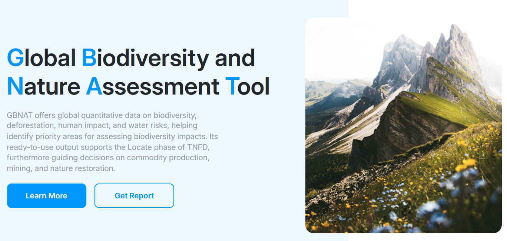
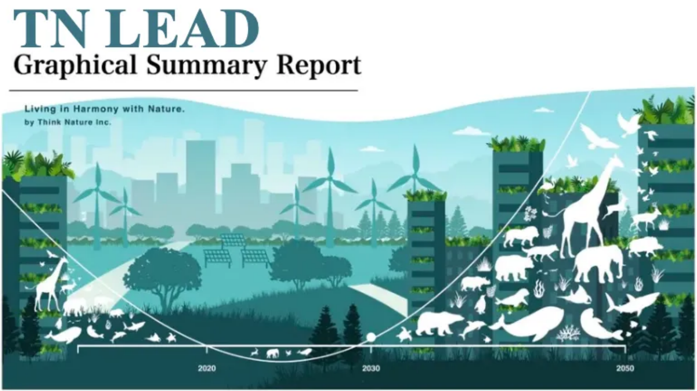

ビジネスと生物多様性の接点を分析する -シンク・ネイチャーの革新的サービス

# 「自然と調和して生きる」

生物多様性は、我々の社会がよって立つ自然資本を根本から支える存在です。
失われゆく自然を再生しなければ、我々の生活が立ち行かなくなる。
この危機感が国際的に共有されたからこそ、「自然と調和して生きる Living in Harmony with Nature」が社会のゴールとして掲げられるようになったのです。

## ビジネスの責任

社会において経済活動を行うビジネスもまた、生物多様性の恩恵を直接的あるいは間接的に享受していることになります。
このような理解から、2022年に採択された「昆明・モントリオール生物多様性枠組」では、個々のビジネスが生物多様性とどのような接点を持ち、リスクを与えているかを評価・開示することがターゲットとして明示されました。
ビジネスの世界も、自然と共生して生きる社会に対するコミットメントを求められていると言えます。

# 科学的評価の重要性

生物多様性とは、地球上に存在する生物の豊かさを表す概念であり、それは必ずしも単一の指標で測ることのできる量ではありません。
したがって、これまでの研究に基づく適切な概念を用いなければ、ビジネスとの接点をリスク・機会といった観点で評価することはできません。
生物多様性を測定し、その生成や維持機構を研究する領域としては、群集生態学、生物地理学、マクロ生態学といった生物学のジャンルが存在します。
これらの領域から得られた知見と相互作用する形で、保全生態学という、より保全に特化した領域も発展してきました。

## シンク・ネイチャーが持つ知見

シンク・ネイチャーには、これらの領域の専門家として、世界の一線で研究活動を行ってきたメンバーが多数在籍しています。
この強固な科学的基盤の上で、これまでも、企業の様々なニーズに対して、適切な科学的な概念・手法と、それを実施するうえで最適な高精度なデータを用いて、ビジネスと生物多様性の接点を定量評価してきました。
これらの知見をもとにリリースしたサービスが、GBNATおよび、TN LEADです。

# シンク・ネイチャーの革新的サービス

## GBNAT

GBNATは、ビジネスのロケーション評価に特化した、オンラインサービスです。
海、陸、淡水すべてをカバーした高解像度の生物多様性の空間データと、生態系とそれに対するインパクトの状態（森林減少、フットプリント増加率、洪水リスク、渇水リスク、水質汚染）を組み合わせて、事業のロケーションを自動で評価します。  

10万種以上の生物種の分布データを網羅し、最先端の科学的知見と機械学習を組み合わせた生物多様性メトリックは、他のツールでは行えない、グローバルな文脈での優先地域の特定を可能にします。
グローバルな拠点を網羅的に評価するこの手法は、すでに複数の上場企業で導入されています。

## TN LEAD

TN LEADは、ビジネスと生物多様性の接点をより詳細に分析し、アクションにつなげるためのサービスです。
自然関連財務情報開示タスクフォース Taskforce on Nature-related Financial Disclosures (TNFD) が提唱するLEAPプロセスに準拠した解析とレポートを提供します。  

提供される分析の中には、気候変動下での原料調達の持続可能性評価や、炭素排出を抑制するEV施策を行った場合の生物多様性ロスの評価といった、業界ごとに特化したシナリオ分析も含まれます。
TN LEADは、GBNATで明らかになった優先地域・セクターを深く掘り下げる、テーラーメード分析サービスと言えるでしょう。

# まとめ

失われゆく自然を再生し、持続可能な社会を実現するため、ビジネスにもアクションが求められています。
そのために欠かせない一歩が、自然と事業のかかわりを正しく理解することです。
それを行うために必要なデータと科学的知見を提供するサービスが、GBNATおよび、TN LEADです。

## 関連リンク

GBNAT  
https://lp.gbnat.com  
TN LEAD  
https://think-nature.jp/service  

