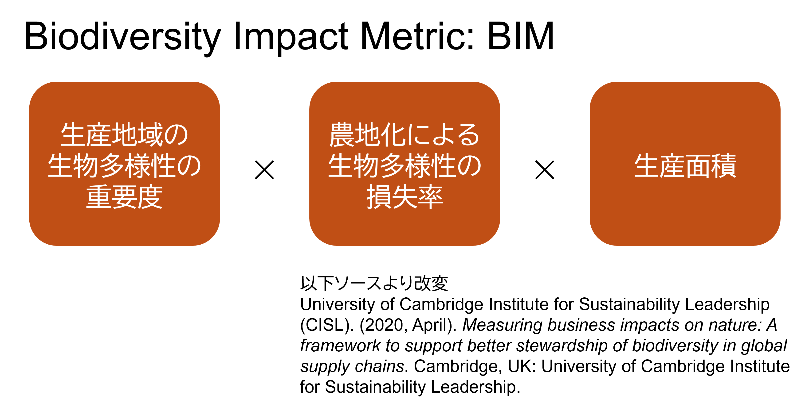

みえない糸をたどる -データ不足下での農作物サプライチェーン分析

# グローバル経済を支える農業コモディティ

生物圏の上になり立つ我々の社会は、世界のいろいろな地域で生産される、自然に由来する原料を消費しています。
このような現代社会の特徴は、テレカップル・ワールド Telecoupled World とも表現されます[1]。
遠く離れた土地での農業生産は、私たちにとってイメージしにくいものかもしれません。
しかし、農作物のサプライチェーンの末端では、大規模な農業生産による作物の病気の拡大が進んでいたり、気候変動による作物の生産効率の低下が生じていることが、これまでの分析で明らかになってきました。
これらの現象の原因として、農地拡大のための土地転換に起因する生物多様性の損失による影響が大きいことも、明らかになっています。

気候変動により地球の自然環境が急激に変化する中で、生産活動と地域の生物の相互作用にも、大きな影響が生じているのです。
生物圏の危機に起因する、この農業生産の将来の不確実性は、さまざまな事業活動にリスクをもたらしうる要因です。
こういった背景に対するリスクの低減、さらにこの危機自体の回避に資するアクションを行うためには、様々な農業生産が、生物多様性に与える影響を定量的に知ること（図１）が不可欠です。
この重要性は、自然関連財務情報開示タスクフォース Taskforce on Nature-related Financial Disclosures (TNFD) が提唱するLEAPプロセスにおいても、LOCATEフェーズの主要な課題として、明示されています。

図１：シンクネイチャーが行う農業コモディティのインパクト評価  

# 生産地域を絞り込む

生物多様性と農業生産の接点を明らかにするためには、生産がどこで行われているのかを知ることが不可欠です。
農作物は、野生植物に由来する生物種であり、それぞれの生長に適した環境があります。
したがって、農作物の生産分布には、明確な地理的偏りが存在します。
図１は、バナナの生産地域の分布を表した地図です。東南アジア原産のバショウ科の植物であるバナナは、熱帯で栽培されています。  

図２：バナナの生産面積分布（赤いほど面積が広い）  

シンク・ネイチャーは、このような農作物の生産分布を世界中のデータソースをもとに構築してきました。
コーヒー、カカオ、パームといった主要コモディティを含む、200以上の作物の分布データを保有しています。
これらのデータは、生産拠点を特定するための情報源として用いられます。  

自社が調達する作物の生産地がある程度明らかになっている場合（例えば州レベルなど）には、該当する地域での農場の分布地点を絞り込むことができます。
生産地点が全く分かっていない場合でも、生産されている可能性のある地域をフィルタリングすることで、潜在的な影響地域を限定することが可能です。  

こうして明らかになった、「調達地域」あるいは「潜在的調達地域」をもとに、農業生産と生物多様性の接点を分析することができます。

# 生物多様性インパクトの定量化

農作物が生物多様性に与えるインパクトは、「①生産地域の生物多様性の重要度」×「②農地化による生物多様性の損失率」×「③生産面積」の積で定量化できます。
この指標は、Biodiversity Impact Metric (BIM) と呼ばれます。
このうち①を調達量から逆算でき、②と③は、シンク・ネイチャー生物多様性データをもとに計算できます。
これにより、作物を生産することによるインパクトが定量化できるのです（図３）。

図３：Biodiversity Impact Metric (BIM) の枠組み  

# 複数のコモディティを比較する

このような分析により、個社が調達するコモディティのインパクト評価の具体的数値が得られます。
こうして明らかになった結果は、依存度の高い農作物が生物多様性に与えているインパクトによる、評判リスクの定量化に直結します。  

複数のコモディティを調達している事業者（商社など）の場合には、同様の分析を複数のコモディティを対象に実施することで、ハイリスクコモディティの優先順位付けを行うことができます。

# スクリーニングの先へ -シナリオ分析

インパクト評価は、持続可能な事業を実現する最初のステップです。
このようなデータを企業の経営戦略に反映させることが、地球規模の生物多様性の危機に立ち向かい、持続可能な社会を実現する上で不可欠であると我々は考えています（例：低インパクト地域に着目した調達戦略へ向けたエンゲージメントの強化）。
実際、自然に配慮した農法を行うことが地域の生物多様性を回復させ、それが生態系による害虫のコントロールに寄与するといった事例も知られています [2]。  

このような考えのもと、シンク・ネイチャーは、特定の調達地点に特化したシナリオ分析を提供することで、ネクストステップを支援します。
人工衛星画像を用いた森林伐採のモニタリングや、異なる気候変動シナリオに基づく将来の生産量の予測など、個社のリスク低減アクションにつながる分析結果を高解像度で提供しています。

[1]: Liu, J., Hull, V., Batistella, M., DeFries, R., Dietz, T., Fu, F., ... & Zhu, C. (2013). Framing sustainability in a telecoupled world. Ecology and Society, 18(2).
[2]: Shahid, M., Farooq, M. O., Razaq, M., Adnan, M., Zahid, S., Hussain, A., & Shah, F. M. (2023). Organic fertility management in cotton Gossypium hirsutum L. fosters arthropod biodiversity and complements pest suppression. Journal of Applied Entomology, 147(10), 1001-1013.

