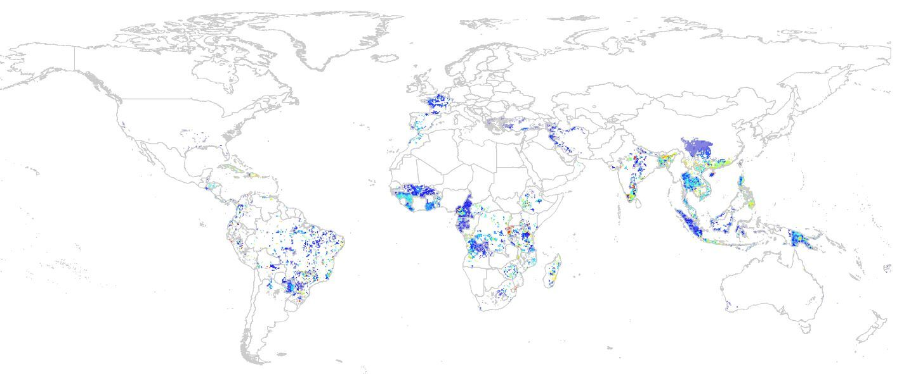

みえない糸をたどる -データ不足下での農作物サプライチェーン分析

# グローバル経済を支える農業コモディティ

生物圏の上になり立つ我々の社会は、世界のいろいろな地域で生産される、自然に由来する原料を消費しています。
このような現代社会の特徴は、テレカップル・ワールド Telecoupled World とも表現されます[1]。
遠く離れた土地での農業生産は、私たちにとってイメージしにくいものかもしれません。
しかし、農作物のサプライチェーンの末端では、大規模な農業生産による作物の病気の拡大が進んでいたり、気候変動による作物の生産効率の低下が生じていることが、これまでの分析で明らかになってきました。
これらの現象の原因として、農地拡大のための土地転換に起因する生物多様性の損失による影響が大きいことも、明らかになっています。

気候変動により地球の自然環境が急激に変化する中で、生産活動と地域の生物の相互作用にも、大きな影響が生じているのです。
生物圏の危機に起因する、この農業生産の将来の不確実性は、さまざまな事業活動にリスクをもたらしうる要因です。
これに対応したリスクの低減、さらにこの危機自体の回避に資するアクションを行うためには、様々な農業生産が、生物多様性に与える影響を定量的に知ることが不可欠です。
この重要性は、自然関連財務情報開示タスクフォース Taskforce on Nature-related Financial Disclosures (TNFD) が提唱するLEAPプロセスにおいても、LOCATEフェーズの主要な課題として、明示されています。

# 生産地域を絞り込む

生物多様性と農業生産の接点を明らかにするためには、生産がどこで行われているのかを知ることが不可欠です。
農作物は、野生植物に由来する生物種であり、それぞれの生長に適した環境があります。
したがって、農作物の生産分布には、明確な地理的偏りが存在します。
図１は、バナナの生産地域の分布を表した地図です。東南アジア原産のバショウ科の植物であるバナナは、熱帯で栽培されています。  

図１：バナナの生産面積分布（赤いほど面積が広い）  

シンク・ネイチャーは、このような農作物の生産分布を世界中のデータソースをもとに構築してきました。
コーヒー、カカオ、パームといった主要コモディティを含む、200以上の作物の分布データを保有しています。
これらのデータは、生産拠点を特定するための情報源として用いられます。  

自社が調達する作物の生産地がある程度明らかになっている場合（例えば州レベルなど）には、該当する地域での農場の分布地点を絞り込むことができます。
生産地点が全く分かっていない場合でも、生産されている可能性のある地域をフィルタリングすることで、潜在的な影響地域を限定することが可能です。  

こうして明らかになった、「調達地域」あるいは「潜在的調達地域」をもとに、農業生産と生物多様性の接点を分析することができます。

# 生物多様性インパクトの定量化

# 複数のコモディティを比較する

# スクリーニングの先へ -シナリオ分析

[1]: Liu, J., Hull, V., Batistella, M., DeFries, R., Dietz, T., Fu, F., ... & Zhu, C. (2013). Framing sustainability in a telecoupled world. Ecology and Society, 18(2).

