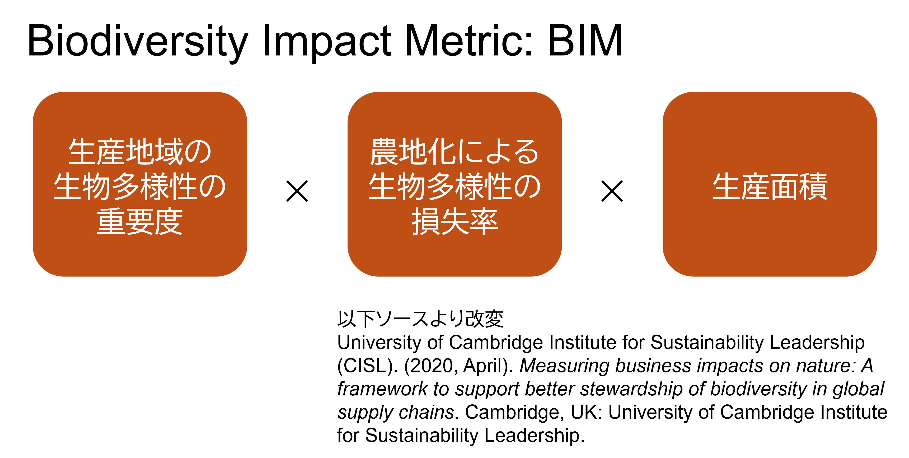

みえない糸をたどる② -データ不足下での鉱物サプライチェーン分析

# EV化を支える鉱山コモディティ

生物圏の上になり立つ我々の社会は、世界のいろいろな地域で生産される、自然に由来する原料を消費しています。
このような現代社会の特徴は、テレカップル・ワールド Telecoupled World とも表現されます[1]。
特に鉱物資源は、機械化された現代の産業の根幹を担っているといえます。  

脱炭素化という社会課題を前に、鉱物資源の重要度はさらに高まっています。
EVの大量導入を行うためには、ニッケル、リチウム、コバルトといった鉱物が、バッテリーの原料としてかつてないほどに需要されることになります。
その一方で、鉱山開発は、熱帯林の大規模伐採による生物多様性への破壊的影響や、地域のコミュニティに対する健康被害といった大きなリスクを伴うことが、明らかになっています [2] 。  

こういった背景に対するリスクの低減、さらにこの危機自体の回避に資するアクションを行うためには、様々な鉱物資源の調達が、生物多様性に与える影響を定量的に知ることが不可欠です。
この重要性は、自然関連財務情報開示タスクフォース Taskforce on Nature-related Financial Disclosures (TNFD) が提唱するLEAPプロセスにおいても、LOCATEフェーズの主要な課題として、明示されています。

# 生産地域を絞り込む

生物多様性と鉱山資源調達の接点を明らかにするためには、採掘がどこで行われているのかを知ることが不可欠です。
鉱山資源は、地球規模の地質学的歴史を反映して、世界中に分布しています。
したがって、鉱物資源の生産分布には、明確な地理的偏りが存在します。
図１は、アルミニウムの原料であるボーキサイト鉱山の分布を表した地図に、各地点の生物多様性の重要度を重ね合わせたものです。
このような分析は、後述するGlobal Biodiversity and Nature Assessment Tool (GBNAT) で提供されています。

図１：ボーキサイト鉱山の分布地点と生物多様性の重要度と完全性  

シンク・ネイチャーは、このような鉱山の分布を世界中のデータソースをもとに構築してきました。
ニッケル、銅、珪砂といった主要な鉱物資源の調達地点情報を保有しています。
これらのデータは、生産拠点を特定するための情報源として用いられます。  

自社が調達する作物の生産地がある程度明らかになっている場合（例えば州レベルなど）には、該当する地域での調達先を絞り込むことができます。
生産地点が全く分かっていない場合でも、生産されている可能性のある地域をフィルタリングすることで、潜在的な影響地域を限定することが可能です。  

こうして明らかになった、「調達地域」あるいは「潜在的調達地域」をもとに、鉱物資源と生物多様性の接点を分析することができます（図２）。

図２：シンクネイチャーが行う鉱物コモディティのインパクト評価  

## ロケーション評価

生産地点の生物多様性の重要度や完全性、水資源や森林の分布を知ることで、生産地域周辺で生じうるリスクを特定することができます。
このような分析は、TNFDで求められるロケーション評価と対応しています。
対応した分析を行うためのツールがGlobal Biodiversity and Nature Assessment Tool (GBNAT)です。
本記事は、インパクト評価にフォーカスしているため、ロケーション評価の詳細は以下の記事をご覧ください。  

# 生物多様性インパクトの定量化

鉱山開発が生物多様性に与えるインパクトは、「①生産地域の生物多様性の重要度」×「②鉱山開発による生物多様性の損失率」×「③生産面積」の積で定量化できます。
この指標は、Biodiversity Impact Metric (BIM) と呼ばれます。
このうち①を調達量から逆算でき、②と③は、シンク・ネイチャー生物多様性データをもとに計算できます。
鉱山開発においては、露天掘りの場合には、自然再生活動を行わない場合には、生物多様性の完全損失が生じることになり、②の値は最大値の１をとります。
この枠組みにより、インパクトが定量化できるのです（図３）。

図３：Biodiversity Impact Metric (BIM) の枠組み  

# 複数のコモディティを比較する

このような分析により、個社が調達するコモディティのインパクト評価の具体的数値が得られます。
こうして明らかになった結果は、依存度の高い鉱物資源が生物多様性に与えているインパクトによる、評判リスクの定量化に直結します。  

複数のコモディティを調達している事業者（商社など）の場合には、同様の分析を複数のコモディティを対象に実施することで、ハイリスクコモディティの優先順位付けを行うことができます。

# スクリーニングの先へ -シナリオ分析

インパクト評価は、持続可能な事業を実現する最初のステップです。
このようなデータを企業の経営戦略に反映させることが、地球規模の生物多様性の危機に立ち向かい、持続可能な社会を実現する上で不可欠であると我々は考えています（例：低インパクト地域に着目した調達戦略へ向けたエンゲージメントの強化）。
鉱山開発後の森林再生活動は、地域の生態系機能の改善に大きく影響することが明らかになっています [3]。

このような考えのもと、シンク・ネイチャーは、特定の調達地点に特化したシナリオ分析を提供することで、ネクストステップを支援します。
人工衛星画像を用いた森林伐採のモニタリングや、異なる気候変動シナリオに基づく将来の生産量の予測など、個社のリスク低減アクションにつながる分析結果を高解像度で提供しています。

図４：シナリオ分析のイメージ  

[1]: Liu, J., Hull, V., Batistella, M., DeFries, R., Dietz, T., Fu, F., ... & Zhu, C. (2013). Framing sustainability in a telecoupled world. Ecology and Society, 18(2).  
[2]: Sovacool, B. K., Ali, S. H., Bazilian, M., Radley, B., Nemery, B., Okatz, J., & Mulvaney, D. (2020). Sustainable minerals and metals for a low-carbon future. Science, 367(6473), 30-33.  
[3]: Worlanyo, A. S., & Jiangfeng, L. (2021). Evaluating the environmental and economic impact of mining for post-mined land restoration and land-use: A review. Journal of Environmental Management, 279, 111623.

