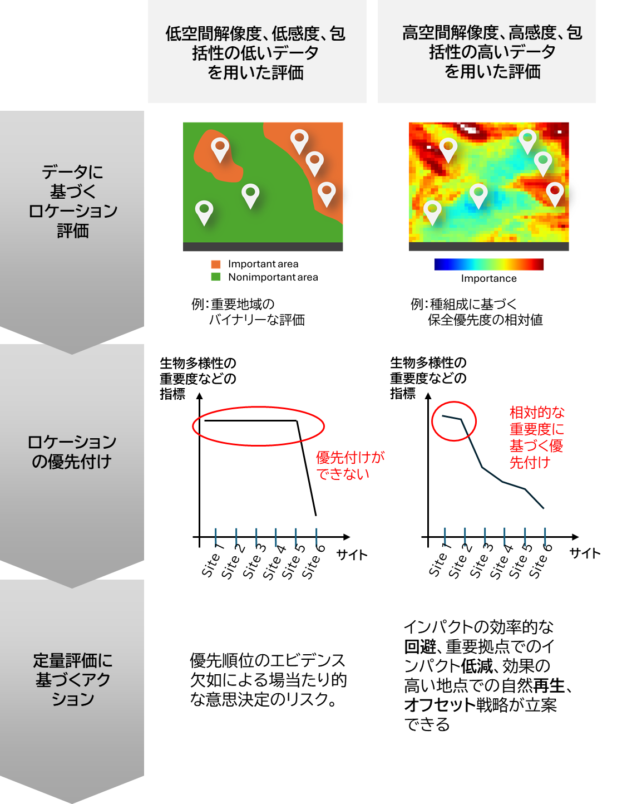

ビジネスと生物多様性が接する社会背景

# わたしたちの生活を支える生物圏

私たちの社会は、生物圏 (biosphere) の上になり立っています。生物多様性は自然資本の土台をなし、世界の経済を支えています [1,2,3]。
そんな中、陸、海の生態系に対する人間によるインパクトは、百万以上の生物種を絶滅リスクにさらしており [4]、生物多様性の急速な減少を引き起こしています [5]。  

生物多様性の保全は、生物多様性条約 Convention on Biological Diversity (DB) のもっともコアなテーマです。2022年には、生物多様性の保全・再生・持続可能な利用を明記した、昆明-モントリオール生物多様性枠組 (KM-GBF) が採択されました。この目標に沿ったアクションは、生物多様性の減少トレンドを増加に転じさせる2030年目標「ネイチャーポジティブ」、2050年目標 "Living in Harmony with Nature" を達成するうえでも欠かせません [6]。ここでビジネスが果たしうる役割は、とても大きなものです。  

# 自然と調和したビジネス

生物多様性の恵みによってもたらされる自然資本は、多様な原料生産を可能にし、それらが国際的に取引されることによって、多くの人の生活が支えられています [7]。グローバルに張り巡らされた生産と消費のサプライチェーンは、異なった場所で、その地域に特有のインパクトを、生物多様性や生態系サービス対して生じさせています（これはテレカップルしたサプライチェーン [8,9] とも称されます。）。  

このトレンドをドライブするのは、グローバルに展開した人間の経済活動であり、したがってそれを変えるためには、ビジネスのあり様を変化させることが重要です。すなわち、持続可能な自然資本の利用のための、生物多様性への投資が求められているのです。

# 科学的な評価の重要性 - GBNATとは

第一のステップは、事業が生物多様性とどのような接点を持ち、自然に対するインパクトを生じさせているかを理解することです。それぞれの接点における企業活動を自然の観点で見直していくことが、生物多様性の危機に立ち向かうことに貢献すると言えます。  

より具体的には、企業活動が行われている場所情報（緯度、経度）を、生物多様性や生態系サービスの空間分布情報と重ね合わせることにより、拠点ごとのステータスを定量評価することが、ここで求められる分析です。この時、適切な科学的方法論に基づく高解像度データを用いることが、後のアクションの質を大きく左右します (Box 1)。  

GBNATはこの課題を解決するために開発された評価ツールです。企業活動と生物多様性の接点を、インパクトや依存の観点から評価することで、情報開示やその先のアクションをサポートします。そのために各拠点の生物多様性と生態系サービスの現状を把握するために必要な指標を整備しています (Figure 1)。  

# Box 1: 高解像度データを用いる重要性

事業活動と生物多様性保全を調和させるためには、どの場所でどのような事業活動を行うかを決める必要がある。そのために不可欠なのが、それぞれの場所の生物多様性や生態系の状況、優先順位を把握することである。
データや指標が不十分なままこのプロセスを進めると、その後の行動計画がすべて実効性のないものに終わる可能性がある。  

# Figure 1: GBNATで提供されるデータレイヤー

[1]: Keith, D.A. et al. (2022) A function-based typology for Earth’s ecosystems. Nature 610(7932): 513-518.
[2]: Paul, C., Hanley, N., Meyer, S. T., Fürst, C., Weisser, W. W., & Knoke, T. (2020) On the functional relationship between biodiversity and economic value. Science Advances 6(5): eaax7712.
[3]: Dasgupta, P. (2021). The economics of biodiversity: the Dasgupta review. Hm Treasury.
[4]: IPBES (2019) Summary for policymakers of the global assessment report on biodiversity and ecosystem services of the Intergovernmental Science-Policy Platform on Biodiversity and Ecosystem Services—Advance Unedited Version
[5]: Tollefson, J. (2019) One million species face extinction. Nature 569(7755): 171.
[6]: Nicholson, E. et al. (2021) Scientific foundations for an ecosystem goal, milestones and indicators for the post-2020 global biodiversity framework. Nature ecology & evolution 5(10): 1338-1349.
[7]: Lenzen, M. et al. (2012) International trade drives biodiversity threats in developing nations. Nature 486(7401): 109-112.
[8]: Liu, J. et al. (2013) Framing sustainability in a telecoupled world. Ecology and Society, 18(2).
[9]: Carmenta, R. et al. (2023). Connected Conservation: Rethinking conservation for a telecoupled world. Biological Conservation 282: 110047.

