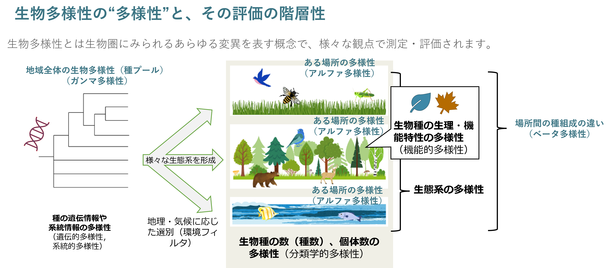

ロケーション評価に必要な指標と概念①

# 全球を統一的枠組みで評価することの必要性

ビジネスと生物多様性の接点を分析する上で、
世界中に分散する企業活動を統一された枠組みで評価することが重要になります。これには2つの理由があります。
1つ目の理由は、生物多様性は空間的な階層性を持って分布しているからであり、2つ目の理由は、社会経済的文脈での実効性につながるからです。以下にそれぞれを説明します。

## 生物多様性の階層性

ローカルな場所ごとの生物の多様性（アルファ多様性と呼ばれます）を左右するのは、局所的な環境だけではありません。大陸の移動や数千万年スケールの気候変動といった、より広い地域に影響を持つ要因も局所に成立する生物相を左右します。地域ごとに異なる種組成の違い（ベータ多様性と呼ばれます）と、局所の多様性が合わさって、世界全体の生物多様性（ガンマ多様性と呼ばれます）が構成されているのです（Figure 1）。  

生物多様性の損失も、この階層に沿って生じます。人為的な土地や海域の改変などが希少種の生息環境を劣化させることによって、局所的な個体群の喪失が生じます（局所絶滅、アルファ多様性の喪失）。それによって個体数の広い優占種の割合が増加し、種組成が単純化し（ベータ多様性の喪失）、この地域的な個体群の喪失が、より広いスケールで進行することで種の絶滅がグローバルな規模で進展するのです（ガンマ多様性の喪失）。  

以上を踏まえて考えると、局所的に測定した種数や機能・系統的（種の形や働き、進化のプロセス）多様性そのものだけでは、その地域の生物多様性の重要度を測定することができないことがわかります。観測された種数が同じ2つの地域でも、より希少な種が集中している場所の方が、種の絶滅を防ぐ観点で緊急性が高い（＝生物多様性の重要度が高い）と言えそうです。一方で、希少種の数が少ない場合でも、分布範囲が極めて狭い種が分布する場合には、その場所の重要性はより高く評価されるべきだと考えられます。  

このように考えると、ある地点だけを見てその場所の重要性を評価することはできないということが分かります。そうではなく、グローバルに統一された枠組みで、種の絶滅を回避する上での各拠点の重要性を順位づけることが、生物多様性の保全の観点でよりフェアな評価といえるのです。

### Figure 1: 生物多様性の階層性

  

## 社会経済的文脈での実効性

無数に存在する事業拠点は、世界中に散らばっています。これらの拠点を、グローバルに統一された枠組みでフェアに評価することは、保全の観点だけでなく、企業のアクションの実効性を高めるという効果もあります。  

例えば、限られたリソースを生息地の再生に用いる場合には、より多くの希少種の生息地を再生しうる地域でのアクションを行うことが、大きな効果につながります。生息地の再生だけではなく、開発の回避や、インパクトの削減を行う際にも、実施候補となる拠点の重要性を相対評価した上でリソース配分を行うことが、費用対効果の最適化に貢献すると考えられます。  

このように、民間セクターが取り組む生物多様性の保全再生への貢献を、有限のリソースが与えられた中での最適化問題と考えたとき、世界中の事業拠点を統一的に評価することが、より良い解を導く上で不可欠なのです。

### Reference

- 久保田 康裕, 楠本 聞太郎, 藤沼 潤一, 塩野 貴之, 生物多様性の保全科学, 日本生態学会誌, 2017, 67 巻, 3 号, p. 267-286.  https://www.jstage.jst.go.jp/article/seitai/67/3/67_267/_pdf/-char/ja