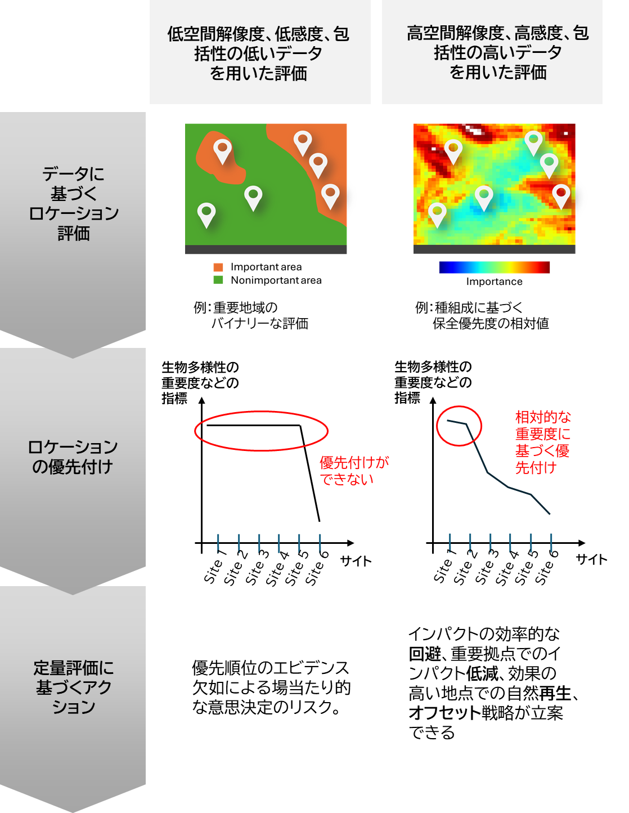

ロケーション評価に必要な指標と概念②

# ビジネスを評価するための生物多様性指標

## 生物多様性の重要度を考慮することの意義

事業が生物多様性に与えるインパクトを測定する方法を考えたとき、事業が行われる前に成立していた生物相のうち、事業によって喪失した割合を測定することが考えられます。この量を測る指標の例が、種ごとの個体数の変化の比を表す MSA (Mean Species Abundance) です。MSA の値は、行われる事業がどれだけの生態系の改変をもたらすかによって異なることになります。この指標は、事業によって改変された地域がどれだけ完全性（元の状態）を保っているかを表すものであるので、「生物多様性の完全性」指標と呼ばれることがあり、[1] 本稿でもこの呼称に従います。  

しかし実際には、ビジネスにおける生物多様性の評価は、この完全性だけではなく、重要度を統合した観点で行われるのが妥当であると考えられます [1,2]。例えば、事業のために同じだけの森林伐採を行ったとしても、場所が異なれば、それだけインパクトの大きさが異なるだろうという考え方です。  

ある事業拠点がもたらしうる最大のインパクトは、その地点の生物相をすべて破壊することです。したがって、拠点の生物多様性の重要度は、潜在的なインパクトの最大量を示すことになります。

## 重要度指標が陥りやすい問題点

重要度を考慮したインパクト評価を行うにあたって、実用上の問題をもたらす大きな要因は、指標の感度の弱さです。

先にみたように、「生物多様性の重要度」を指標化する上での有力な考え方は、生物多様性を保全する上での重要度合いを定量化することです。その理由は、「より高いスコアを持つ地点が保全上重要であることを示す」指標は、「より高いスコアを持つ地点がビジネスにおけるインパクトを評価する上で重要であることを示す」と、自然に解釈されるからです。  

それゆえに、ビジネスの評価をする場面で、既存の「生物多様性の重要度」指標として、希少種の保全を目的として開発された指標を用いていることが少なくありません。実際、Hawkinsら [1] も、希少種の分布レンジマップに基づく指標を、インパクト評価における重要度指標として推奨しています。しかし、希少な種を保全するために有効な指標が、ビジネスのインパクトを定量化するための指標としては有効とはいえないという場面が、実際には存在します。  

### 感度の問題

希少種保全の現場を考えると、実際にはその種が分布しているにもかかわらず、それをとらえ損ねてしまうことは、絶滅のリスクを増大させることになることから、避けなければなりません（オミッションエラーの回避）。そのために、種の分布を過大評価することは容認されることになります（コミッションエラーの容認）[3]。その結果、保全上の実用性を求めて作られた指標によって「重要である」と判断される地域は、保全することが望ましい地域の最大のセットに近づくことになります。一方で、ビジネスにおける優先付けは、限られたリソースの最適配分のために行われるものであることから、重要度の過大評価により、拠点間の優先付けが失敗してしまうと、その後のアクション戦略の実効性が低下することになります。

### 包括性の問題

ビジネスが生物多様性の再興に貢献することの根拠は、生物多様性を基盤としたさまざまな自然資本に依存して、我々の経済活動が成立しているからでした。ここで、自然資本を支える生物多様性とは、決して希少種だけを指すものではありません。農業生産を支える送粉昆虫は、個体数の多い普通種であることが多く、炭素固定サービスを提供する森林の大部分は、やはりその地ではありふれた種であると考えられます。  

したがって、ビジネスが着目すべき生物多様性の重要度指標としては、希少種だけではなく、地球上の生物相の大多数を占める普通種の分布をも考慮した、指標を用いることが、よりその目的に適っていると考えられるのです。

## 高感度かつ包括的なデータを用いた指標

これまでに見た、不完全な指標がもたらしうる問題と、それが高感度（＝過剰なコミッションエラーを抑制する上で十分な解像度を持つ）かつ包括的なデータを用いた評価により、どのように抑制されるかを、以下の Box 1 に示しました。  

以降のセクションでは、シンク・ネイチャーの生物多様性指標が、これらの問題をどのように解決しているかを解説します。

### Box 1: 目的に合致したデータを用いる重要性

事業活動と生物多様性保全を調和させるためには、どの場所でどのような事業活動を行うかを決める必要がある。そのために不可欠なのが、それぞれの場所の生物多様性や生態系の状況、優先順位を把握することである。
データや指標が不十分なままこのプロセスを進めると、その後の行動計画がすべて実効性のないものに終わる可能性がある。  

- [1]: Hawkins F. et al. (2023) Bottom-up global biodiversity metrics needed for businesses to assess and manage their impact. Conservation Biology 38:  e14183. https://doi.org/10.1111/
cobi.14183
- [2]: Cambridge Institute for Sustainability Leadership (2020) Measuring business impacts on nature: A framework to support better stewardship of biodiversity in global supply chains. https://www.cisl.cam.ac.uk/system/files/documents/
biodiversity-metric-supplementary-material.pdf
- [3]: Rondinini, C., Wilson, K. A., Boitani, L., Grantham, H., & Possingham, H. P. (2006). Tradeoffs of different types of species occurrence data for use in systematic conservation planning. Ecology letters, 9(10), 1136-1145.